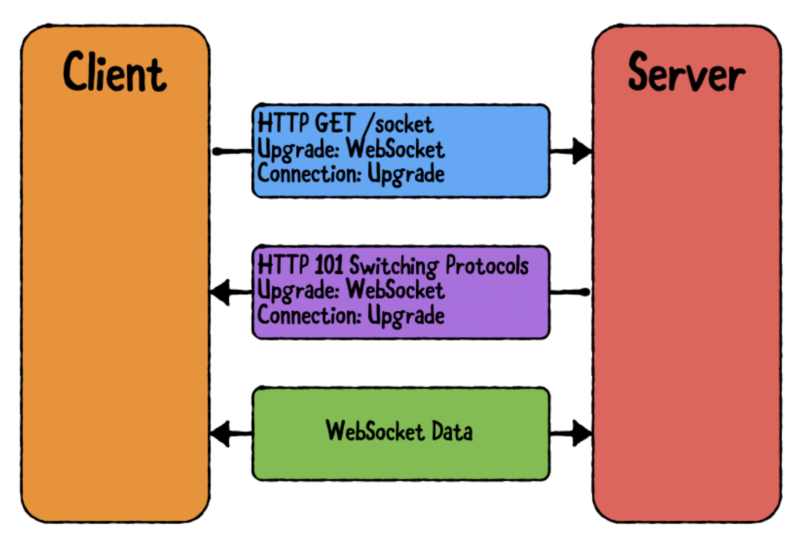
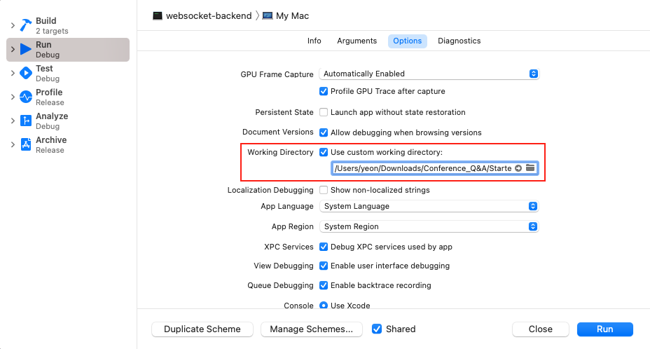
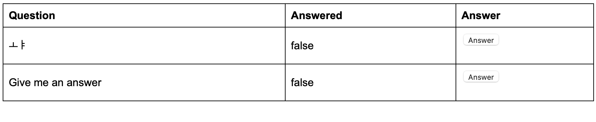

## WebSocket

> 서버와 클라이언트 사이에 양방향 통신을 할 수 있도록 해주는 network protocol이다. 
> HTTP 통신의 request, response 패턴과는 다르게 WebSocket을 사용하면 원하는 시점, 원하는 방향으로 메시지를 전송할 수 있다.
> 주로 채팅을 기반으로하는 앱이나 사용자와 서버의 대화가 빈번하게 이뤄질 때 사용하게 된다. 


## 목차

- [1️⃣ WebSocket Server 생성](#1️⃣-WebSocket-Server-생성)
- [2️⃣ WebSocket Data란](#2️⃣-WebSocket-Data란)
- [3️⃣ UI setup 하기](#3️⃣-UI-setup-하기)
- [4️⃣ 서버와 연결하기](#4️⃣-서버와-연결하기)
- [5️⃣ Data Structure 생성](#5️⃣-Data-Structure-생성)
- [6️⃣ Handle Data](#6️⃣-Handle-Data)
- [7️⃣ Server Handshake 설정하기](#7️⃣-Server-Handshake-설정하기)
- [8️⃣ Question 보내기](#8️⃣-Question-보내기)
- [9️⃣ WebSocket Data 수신하기](#9️⃣-WebSocket-Data-수신하기)
- [🔟 기존의 하드코딩된 질문 array 제거](#🔟-기존의-하드코딩된-질문-array-제거)
- [1️⃣1️⃣ 질문 답변하기](#1️⃣1️⃣-질문-답변하기)
- [1️⃣2️⃣ Answer button 구현](#1️⃣2️⃣-Answer-button-구현)


### 1️⃣ WebSocket Server 생성

WebSocket connection은 handshake로부터 시작된다. 



1. client가 2개의 **특별한 header(Upgrade: WebSocket, Connection: Upgrade)** 를 포함하는 평범한 HTTP Request를 보낸다
2. Server가 `HTTP 101 Switching protocols` 상태 코드를 **2개의 특별한 header**와 함께 답장한다. <br> `HTTP 101 Switching protocols` : 평상시에는 HTTP로 통신하지만 미래에 언젠가는 다른 것을 사용할 것이다라는 의미한다.
3. 위의 과정이 끝나면 handshake는 끝나고 WebSocket connection이 이뤄지게 된다.

서버 코드에가서 다음과 같이 설정을 해주어야한다. 
```swift
func webSocket(req: Request, socket: WebSocket) {
  socket.onText { _, text in print(text) }
}
```
WebSocket connection으로부터 받은 모든 텍스트 메시지를 출력해주도록 한다.
```swift
routes.webSocket("socket", onUpgrade: self.webSocket)
```
그리고 클라이언트가 서버에 connect 될 수 있도록 위의 route를 추가해준다. 이때 기존의 HTTP method 대신에 `routes.webSocket` 을 사용하여 Vapor가 **handshaking과정을 알아서 해주도록한다.** 


이후 WebSocket server가 제대로 되었는지 확인한다. 

http://www.websocket.org/echo.html

그런데 여기 들어가면 403 뜬다... 

그러나 밑에 **ws://localhost:8080/socket** 치고 이동하면 Xcode log에 GET / socket이 뜨는 걸로봐서는 connect된 것 같다.

[이제 서버를 생성했으니 data에 대해서 알아보자](#2️⃣-WebSocket-Data란)


### 2️⃣ WebSocket Data란

#### WebSocket Message란

> WebSocket frame은 HTTP headers와 비교할 수 있는 몇몇 bits와 실제 메시지로 구성된다. 
>
> 이때 만약 메시지가 너무 크다면 여러 frame을 사용하여 메시지로 보낼 수 있다.


#### frame parts

- `FIN` : 마지막 frame인지 아니면 뒤에 추가 frame이 있는지를 나타내는 **single bit**
- `opcode` : 어떠한 타입의 메시지인지와 payload data를 어떻게 처리할 지를 나타내는 **four bits**
- `MASK` : 메시지가 masked 되었는지 나타내는 **single bit**이며, 클라이언트와 서버 사이의 모든 메시지는 반드시 masked되어야한다
- `Payload length` : HTTP Content-Length header와 같이 bits 안에 payload data가 얼마나 큰지를 나타내며 **7, 23, 71 bits**로 표현
- `Masking key` : 메시지를 mask 하는데 사용한 key를 포함하는 **four bits**이며, 만약 `MASK` bit이 0 이면 쓰지 않아도 된다
- `Payload data` : 메시지의 나머지 부분에는 실제 payload가 포함된다


이때 `opcode` 는 2개의 타입이 존재한다. 

- `non-control frames` : continuation / text / binary → payload를 decode하는 방식
- `control frames` : connection close / ping / pong → message의 특별한 타입을 의미


그리고 RFC state에 따라서 클라이언트와 서버 간의 메시지는 **반드시 mask 처리 되어야한다.** 이때 mask는 **4개의 랜덤 bits**를 mask key로 생성하여 사용하며, payload data에 있는 **모든 byte는 mask key와 XOR 처리**한다. (이는 payload length 에 영향을 끼치지 않음) 

Unmask 하는 과정은 위의 과정을 다시 수행하면 XOR의 성질에 따라서 다시 message를 확인할 수 있다. 

[WebSocket Data에 대해서 알아보았으니, 간단한 App UI를 설정하자.](#3️⃣-UI-setup-하기)


### 7️⃣ Server Handshake 설정하기

QuestionController.swift 파일에서 아래와 같이 대체한다.

```swift
func webSocket(req: Request, socket: WebSocket) {
        self.wsController.connect(socket)
}
```

이게 실행되면 route collection은 더 이상 socket connection을 제어하지 못하게 된다. 

이제 WebSocketController.swift를 열어서 `connect()` 를 구현해준다. 

```swift
func connect(_ ws: WebSocket) {
    // 1
    let uuid = UUID()
    self.lock.withLockVoid {
      self.sockets[uuid] = ws
    }
    // 2
    ws.onBinary { [weak self] ws, buffer in
      guard let self = self,
        let data = buffer.getData(
          at: buffer.readerIndex, length: buffer.readableBytes) else {
            return
      }

      self.onData(ws, data)
    }
    // 3
    ws.onText { [weak self] ws, text in
      guard let self = self,
        let data = text.data(using: .utf8) else {
          return
      }

      self.onData(ws, data)
    }
    // 4
    self.send(message: QnAHandshake(id: uuid), to: .socket(ws))
}
```

1. 매번 socket connection이 생성될 때마다 각각을 식별하기 위해서 랜덤한 UUID를 생성하고, 이 UUID를 키로하는 dictionary 에 connection을 저장한다 
2. `binary data` 를 받은 경우에는 SwiftNIO's `ByteBuffer` 에 이를 저장해준다. 이때 `getData` 를 사용하여 buffer로부터 `Data` 객체를 얻고, 이를 넘겨서 처리한다
3. `text data` 를 받은 경우에는 String.data를 사용해서 `Data` 객체를 얻고, 이를 넘겨서 처리한다
4. 1에서 생성한 UUID를 포함하는 `QnAHandshake` 메시지를 연결 클라이언트에게 보내준다


이때 `QnAHandshake` 타입은 ClientApp과 동일하며, 대신 handshake로 지정된 `type` 속성을 가지고 있다. 

위의 4번에서 send를 해주기 때문에 `send()` 를 아래와 같이 구현하면 된다. 

```swift
func send<T: Codable>(message: T, to sendOption: WebSocketSendOption) {
    logger.info("Sending \(T.self) to \(sendOption)")
    do {
      // 1
      let sockets: [WebSocket] = self.lock.withLock {
        switch sendOption {
        case .id(let id):
          return [self.sockets[id]].compactMap { $0 }
        case .socket(let socket):
          return [socket]
        }
      }
      
      // 2
      let encoder = JSONEncoder()
      let data = try encoder.encode(message)
      
      // 3
      sockets.forEach {
        $0.send(raw: data, opcode: .binary)
      }
    } catch {
      logger.report(error: error)
    }
}
```

1. `WebSocketSendOption` 에 따라서, 연결된 socket들 중에서 socket을 선택한다
2. `JSONEncoder` 를 사용해서 message를 encoding
3. encoded된 데이터를 1에서 선택된 socket으로 binary opcode를 사용해서 보낸다


#### 💡 WebSocketController가 가지는 타입들

- `Lock` : 
- `Database` :
- `Logger` : 


#### 💡 WebSocketSendOption 확장

이 프로젝트에서는 하나의 socket에만 데이터를 보내지만, 모든 소켓이나 ID에 따른 여러 socket으로 데이터를 보내기 위해서는 아래와 같이 작성하면 된다. 

```swift
enum WebSocketSendOption {
    case id(UUID), socket(WebSocket)
    case all, ids([UUID])
}

let sockets: [WebSocket] = self.lock.withLock {
        switch sendOption {
        case .id(let id):
            return [self.sockets[id]].compactMap { $0 }
        case .socket(let socket):
            return [socket]
        case .all:
            return self.sockets.values.map { $0 }
        case .ids(let ids):
            return self.sockets.filter { key, _ in ids.contains(key) }.map { $1 }
        }
    }
```

[이제 iOS에서 질문을 보내보자](#8️⃣-Question-보내기)


### 9️⃣ WebSocket Data 수신하기

Socket connection이 처음으로 이뤄지면, 이제 몇 가지만 해결해주면 된다. 

- 클라이언트가 보낸 질문을 db에 저장한다
- back-end를 질문의 출처로 사용할 수 있도록 iOS app을 Update 
- 질문에 답을 해줄 수 있는 함수 추가
- iOS app에 질문에 대한 답을 보여주도록 Update


#### Data 저장하기 

data를 저장하기 위해서 WebSocketController에 `onNewQuestion()` 함수를 추가해준다. 

```swift
func onNewQuestion(_ ws: WebSocket, _ id: UUID, _ message: NewQuestionMessage) {
      let q = Question(content: message.content, askedFrom: id)
      self.db.withConnection {
        // 1
        q.save(on: $0)
      }.whenComplete { res in
        let success: Bool
        let message: String
        switch res {
        case .failure(let err):
          // 2
          self.logger.report(error: err)
          success = false
          message = "Something went wrong creating the question."
        case .success:
          // 3
          self.logger.info("Got a new question!")
          success = true
          message = "Question created. We will answer it as soon as possible :]"
        }
        // 4
        try? self.send(message: NewQuestionResponse(
          success: success,
          message: message,
          id: q.requireID(),
          answered: q.answered,
          content: q.content,
          createdAt: q.createdAt
        ), to: .socket(ws))
    }
}
```

1. `Question` 타입을 생성하고, db에 저장한다
2. db에 저장이 실패한 경우에는 log에 error를 알려주고, 성공하지 못한 것을 알려준다
3. db에 저장이 성공한 경우, 새로운 질문을 받았다고 log에 띄워준다
4. 클라이언트에게 질문을 받았는지 알려주는 메시지를 보내며, 성공인지 실패인지도 알려준다


`onData()` 함수를 아래와 같이 수정해준다. 

```swift
func onData(_ ws: WebSocket, _ data: Data) {
    let decoder = JSONDecoder()
    do {
        // 1
        let sinData = try decoder.decode(QnAMessageSinData.self, from: data)
        // 2
        switch sinData.type {
        case .newQuestion:
                // 3
            let newQuestionData = try decoder.decode(NewQuestionMessage.self, from: data)
            self.onNewQuestion(ws, sinData.id, newQuestionData)
        default:
            break
        }
    } catch {
        logger.report(error: error)
    }
}
```

1. `QnAMessageSinData` 타입을 decode 해서 어떠한 타입의 메시지가 왔는지를 확인
2. 현재 서버에서는 하나의 타입만 수용하도록 되어있기 때문에, type을 변경해준다
3. `NewQuestionMessage` 타입 전체를 decode하여 `onNewQuestion` 의 매개변수로 전달한다

위의 두 함수는 클라이언트로부터 받은 질문을 db에 저장하고, 클라이언트에게 확인 메시지를 보내준다. 

[클라이언트에게 메시지가 제대로 가는지 확인해보자](#🔟-기존의-하드코딩된-질문-array-제거)


### 1️⃣1️⃣ 질문 답변하기

질문에 답을 하기 위해 관리자 페이지를 Leaf를 사용해서 생성할 것이다. 

`Leaf` : HTML 페이지들을 생성하는 Vapor의 templating language이다

QuestionsController.swift에서 `index()` 를 아래로 대체한다. 

```swift
struct QuestionsContext: Encodable {
  let questions: [Question]
}

func index(req: Request) throws -> EventLoopFuture<View> {
  // 1
  Question.query(on: req.db).all().flatMap {
    // 2
    return req.view.render("questions", QuestionsContext(questions: $0))
  }
}
```

1. db에서 모든 `Question` 객체를 선택한다
2. 1에서 가져온 question의 객체들을 QuestionsContext 타입의 초기화하는데 사용하며 이를 leaf view로 반환해준다

Leaf에게 어디서 template를 찾을 지를 먼저 알려주어한다. 이를 위해서는 `Cmd-Option-R` 이나 `Edit Scheme` → `Options` → `Working Directory` 로 간다. 



이후에 서버를 run하고 http://localhost:8080으로 들어가면 3개의 열을 가지는 기본적인 HTML 테이블이 있는 것을 확인할 수 있다. Question, Answered, Answer이렇게 3개의 열을 가지며, 클라이언트에서 질문을 하면 업데이트가 된다. 



이때 Answer 열에 있는 `answer` 버튼을 눌러도 아직 페이지가 구현되지 않아서  404에러가 발생된다. 

[이제 answer button을 구현하자](#1️⃣2️⃣-Answer-button-구현)


### 1️⃣2️⃣ Answer button 구현

QuestionController.swift 파일에서 `index(_:)` 함수 밑에 새로운 route를 추가해준다. 

```swift
func answer(req: Request) throws -> EventLoopFuture<Response> {
    // 1
    guard let questionId = req.parameters.get("questionId"),
          let questionUid = UUID(questionId) else {
        throw Abort(.badRequest)
    }
    // 2
    return Question.find(questionUid, on: req.db)
        .unwrap(or: Abort(.notFound))
        .flatMap { question in
            question.answered = true
            // 3
            return question.save(on: req.db).flatMapThrowing {
                // 4
                try self.wsController.send(message: QuestionAnsweredMessage(questionId: question.requireID()), to: .id(question.askedFrom))
                // 5
                return req.redirect(to: "/")
            }
        }
}
```

1. 질문의 ID가 실제로 유효한 UUID를 가지고 있는지 확인한다
2. 해당 질문을 db의 `Question` 에서 검색한다
3. 검색 결과의 question의 `answered` 를 true로 설정해주고, db에 question을 저장한다
4. 클라이언트에게 question이 answered되었다고 나타내기 위해서 send한다
5. updated된 front end를 보여주기 위해서 index page로 redirect 시킨다

마지막으로 `boot` 에 route를 등록해준다. 

[그리고 실행시키기전에 iOS app에서 reponse에 따라서 화면을 변화시켜주어야한다.](#1️⃣3️⃣-서버에-Vengeance를-사용해서-연결하기)


## Client App


### 3️⃣ UI setup 하기

```swift
    // 1
    @State var newQuestion: String = ""
    
    // TODO: Remove following line when socket is implemented.
    @State var questions: [String] = []
    
    // 2
    @ObservedObject var keyboard: Keyboard = .init()
    @ObservedObject var socket: WebSocketController = .init()
    
    var body: some View {
      // 3
      VStack(spacing: 8) {
        Text("Your asked questions:")
        Divider()                               // 선을 의미
        // 4
        // TODO: Update list when socket is implemented.
        List(self.questions, id: \.self) { q in
          VStack(alignment: .leading) {
            Text(q)
            Text("Status: Unanswered")
              .foregroundColor(.red)
          }
        }
        Divider()
        // 5
        TextField("Ask a new question", text: $newQuestion, onCommit: {
          guard !self.newQuestion.isEmpty else { return }
          self.socket.addQuestion(self.newQuestion)
          // TODO: Remove following line when socket is implemented.
          self.questions.append(self.newQuestion)
          self.newQuestion = ""
        })
          .textFieldStyle(RoundedBorderTextFieldStyle())
          .padding(.horizontal)
          .padding(.bottom, keyboard.height)
          .edgesIgnoringSafeArea(keyboard.height > 0 ? .bottom : [])
      }
      .padding(.vertical)
      // 6
      .alert(item: $socket.alertWrapper) { $0.alert }
    }
```

1. 화면에서 2개의 `State` 변수가 존재하는데, `newQuestion` 은 사용자의 새로운 질문에 대한 input을 담고, `questions` 는 그 전에 했던 questions들을 일시적으로 담아두는 변수이다. 
2. `ObservedObject` 들이 있다. `keyboard` 는 keyboard가 활성화될 때 textfield를 위로 움직여주며, `WebSocketController` 는 필요한 모든 WebSocket 코드들을 가지고 있다. 
3. 화면의 body에는 간단한 수직 스택뷰인 `VStack` 을 가지고 있다.
4. `Vstack` 의 첫 번째 섹션은 모든 질문을 포함하고 있는 `List` 이다. (추후에 이를 WebSocketController data에 연결)
5. `TextField` 는 새로운 질문을 위해서 있으며, 실제 WebSocket과 연결되면 지금 있는 `self.questions` 배열을 지우고 서버에 data를 저장한다
6. 마지막으로 WebSocket이 error를 report하는 경우에 사용하는 alert를 올려놓는다


⚠️ 이때 keyboard에 대한 textfield padding이 맞는 건지는 잘 모르겠네여.. 너무 많이 올라가는 느낌?

[간단한 UI는 완성되었으니 서버와 연결하기 위해서 코드를 작성하자](#4️⃣-서버와-연결하기)


### 4️⃣ 서버와 연결하기

이제 실제로 서버와 연결할 수 있도록 한다. 먼저 `connect()` 를 구현한다.

```swift
func connect() {
    self.socket = session.webSocketTask(with:
      URL(string: "ws://localhost:8080/socket")!)
    self.listen()
    self.socket.resume()
}
```

socket을 URLSessionWebsocketTask를 가지도록 설정해준다. 

그리고 이제 `listen()` 을 구현해준다.

```swift
func listen() {
  // 1
  self.socket.receive { [weak self] (result) in
    guard let self = self else { return }
    // 2
    switch result {
    case .failure(let error):
     print(error)
      // 3
      let alert = Alert(
          title: Text("Unable to connect to server!"),
          dismissButton: .default(Text("Retry")) {
            self.alert = nil
            self.socket.cancel(with: .goingAway, reason: nil)
            self.connect()
          }
      )
      self.alert = alert
      return
    case .success(let message):
      // 4
      switch message {
      case .data(let data):
        self.handle(data)
      case .string(let str):
        guard let data = str.data(using: .utf8) else { return }
        self.handle(data)
      @unknown default:
        break
      }
    }
      // 5
    self.listen()
  }
}
```

1. `URLSessionWebSocketTask.receive` 콜백을 구현해준다. 즉, 서버가 메시지를 받으면 이 클로저가 실행된다. 이때 `self` 를 weak capture하여 전체 클로저를 실행하기 전에 `self` 가 nil이 아닌 것을 보장한다.
2. `Result<URLSessionWebSocketTask.Message, Error>` 타입으로 클로저에게 값이 넘어오게 되므로 switch로 성공인 경우와 에러인 경우를 처리한다
3. Error인 경우에는 나중에 보여줄 SwiftUI `Alert` 를 생성
4. Success인 경우에는 `handle()` 함수로 값을 넘겨준다.
5. `URLSessionWebSocketTask.receive` 는 **일회성 call-back을 등록**하기 때문에, call-back이 실행된 이후에 **다시 등록하여 새로운 메시지를 계속해서 받을 수 있도록 한다.** 

이제 서버는 메시지를 받을 준비를 했지만, 아직 서버에서 어떠한 종류의 메시지를 받을 지 모르기 때문에 [이를 위해서 Data Structure를 생성해주자.](#5️⃣-Data-Structure-생성)


### 5️⃣ Data Structure 생성

새로운 WebSocketTypes 파일을 생성하고 아래의 코드를 작성한다. 

```swift
import Foundation
enum QnAMessageType: String, Codable {
  // Client to server types
  case newQuestion
  // Server to client types
  case questionResponse, handshake, questionAnswer
}

struct QnAMessageSinData: Codable {
  let type: QnAMessageType
}
```

`QnAMessageType` 은 클라이언트에서 서버로 가는 타입과, 서버에서 클라이언트로 오는 타입을 가진다.

서버와 클라이언트 간의 전송되는 모든 메시지는 `type` 을 포함해서 보내, 수신자가 메시지를 어떠한 타입으로 decode해야할 지 알게 해준다. 

이제 실제 각각의 메시지 타입들에 대한 구조를 추가해준다. 

```swift
struct QnAHandshake: Codable {
  let id: UUID
}

struct NewQuestionMessage: Codable {
  var type: QnAMessageType = .newQuestion
  let id: UUID
  let content: String
}

class NewQuestionResponse: Codable, Comparable {
  let success: Bool
  let message: String
  let id: UUID?
  var answered: Bool
  let content: String
  let createdAt: Date?
  
  static func < (lhs: NewQuestionResponse, rhs: NewQuestionResponse) -> Bool {
    guard let lhsDate = lhs.createdAt,
      let rhsDate = rhs.createdAt else {
        return false
    }

    return lhsDate < rhsDate
  }
  
  static func == (lhs: NewQuestionResponse, rhs: NewQuestionResponse) -> Bool {
    lhs.id == rhs.id
  }
}

struct QuestionAnsweredMessage: Codable {
  let questionId: UUID
}
```

이때 `NewQuestionMessage` 를 제외하고는 전부 서버에서 클라이언트로의 타입들이라서 `type` 속성이 따로 없다. 

[데이터 속성을 설정했으니, 해당 데이터를 다뤄보자](#6️⃣-Handle-Data)


### 6️⃣ Handle Data

이제 서버로 하여금 연결된 클라이언트가 보낸 메시지가 어떠한 타입인지 알게 해주자. 

```swift
func handle(_ data: Data) {
    do {
      // 1
      let sinData = try decoder.decode(QnAMessageSinData.self, from: data)
      // 2
      switch sinData.type {
      case .handshake:
        // 3
        print("Shook the hand")
        let message = try decoder.decode(QnAHandshake.self, from: data)
        self.id = message.id
      // 4
      case .questionResponse:
        try self.handleQuestionResponse(data)
      case .questionAnswer:
        try self.handleQuestionAnswer(data)
      default:
        break
      }
    } catch {
      print(error)
    }
}
```

1. `QnAMessageSinData` 타입을 선언한 타입으로 decode 한다. 그 결과는 `type` 필드를 알려줄 것이다. 
2. `type` 을 switch case로 하여 각각에 type에 맞춰 핸들링 한다
3. `handshake` 타입인 경우에는 decode하고, ID를 저장한다. 
4. `questionResponse, questionAnswer` 타입인 경우에는 특정 처리 함수로 넘겨준다. 

이제 서버와 통신하기 전에 서버측에서도 나중에 클라이언트 식별을 위해서 custom handshake를 클라이언트에게 보내줘야한다. 또한 클라이언트는 서버에게 새로운 질문을 보내야한다. 

이 두 가지에 대해서 하나씩 다뤄보자.  

[먼저 서버에서 custom handshake를 설정해주자](#7️⃣-Server-Handshake-설정하기)

### 8️⃣ Question 보내기

WebSocketController.swift에서 `addQuestion()` 을 구현해준다.

```swift
func addQuestion(_ content: String) {
    guard let id = self.id else { return }
    // 1
    let message = NewQuestionMessage(id: id, content: content)
    do {
      // 2
      let data = try encoder.encode(message)
      // 3
      self.socket.send(.data(data)) { (err) in
        if err != nil {
          print(err.debugDescription)
        }
      }
    } catch {
      print(error)
    }
}
```

1. handshake message로부터 받은 ID와 사용자가 입력한 질문 content를 가지는 Codable을 채택한 `NewQuestionMessage` 을 생성한다
2. 1에서 생성한 message를 `Data` 객체로 encode한다
3. 결과를 binary opcodew를 사용하여 server로 보낸다. 이때 `URLSession` 이 메시지에 mask를 관리해준다


이후에 서버 빌드하고 실행시키고, 앱 실행하면 서버에 다음과 같은 로그 출력

```swift
[ INFO ] GET /socket
[ INFO ] Sending QnAHandshake to socket(WebSocketKit.WebSocket)
```

메시지를 입력해서 보내면 아래와 같은 로그 출력

```swift
[ INFO ] {"type":"newQuestion","id":"31059247-BE17-4FF9-9739-36AA1F08FED6","content":"Hello"}
```

[이제 보낸 질문을 서버에서 수신하도록 하자](#9️⃣-WebSocket-Data-수신하기)


### 🔟 기존의 하드코딩된 질문 array 제거

기존의 iOS에서 서버와 연결하기 전에 질문을 array로 가지고 있었다. 이를 제거해주고 서버에서 받아올 수 있도록 하자.

WebSocketController에 아래 변수를 추가하고 init()에서 빈 딕셔너리로 초기화해준다

```swift
@Published var questions: [UUID: NewQuestionResponse]

init() {
  //...
  self.questions = [:]
}
```

`handleQuestionResponse()` 함수를 아래와 같이 작성해준다. 

```swift
func handleQuestionResponse(_ data: Data) throws {
    // 1
    let response = try decoder.decode(NewQuestionResponse.self, from: data)
    DispatchQueue.main.async {
       if response.success, let id = response.id {
        // 2
        self.questions[id] = response
        let alert = Alert(title: Text("New question received!"),
                          message: Text(response.message),
                          dismissButton: .default(Text("OK")) { self.alert = nil })
        self.alert = alert
      } else {
        // 3
        let alert = Alert(title: Text("Something went wrong!"),
                          message: Text(response.message),
                          dismissButton: .default(Text("OK")) { self.alert = nil })
        self.alert = alert
      }
    }
}
```

1. `NewQuestionResponse` 메시지 전체를 decode한다
2. response가 성공이라면, questions 딕셔너리에 이를 저장하고 성공 alert를 띄운다
3. response가 실패라면, 에러 alert를 띄운다


이제 새로운 data source와 UI를 연결해주면 된다. 

ContentView.swift 파일에서 기존의 body의 List부분을 아래와 같이 대체해준다. 

```swift
List(socket.questions.map { $1 }.sorted(), id: \.id) { q in
    VStack(alignment: .leading) {
      Text(q.content)
      Text("Status: \(q.answered ? "Answered" : "Unanswered")")
        .foregroundColor(q.answered ? .green : .red)
    }
  }
```

기존의 코드와 비슷하지만, data source로 socket을 사용하며, 클라이언트의 계정으로 질문에 대한 `answered` 프로퍼티를 가져온다.

이때 기존의 `@State var questions` 는 삭제하고, `self.questions.append` 도 사용하지 않으니 삭제해주면 된다. 

서버와 클라이언트를 실행시키면 잘 작동한다. 

[이제 질문에 대한 답변을 구현 하러 가자](#1️⃣1️⃣-질문-답변하기)


### 1️⃣3️⃣ 서버에 Vengeance를 사용해서 연결하기

WebSocketController.swift 파일에서 `handleQuestionAnswer(_:)` 함수를 다음과 같이 수정하자.

```swift
func handleQuestionAnswer(_ data: Data) throws {
    // 1
    let response = try decoder.decode(QuestionAnsweredMessage.self, from: data)
    DispatchQueue.main.async {
        // 2
        guard let question = self.questions[response.questionId] else { return }
        question.answered = true
        self.questions[response.questionId] = question
    }
}
```

1. 전체 메시지를 decode
2. main queue에서 `questions` 딕셔너리에 있는 question을 update해준다. 이때 UI도 같이 업데이트 되기 때문에 main queue에서 진행됨

이제 실행해보면 http://localhost:8080에서 `answer` 버튼을 누르면 iOS App에서도 수정되는 것을 확인할 수 있다.


## ⚠️ 서버 생성 및 설정 도중 발생한 오류

```bash
bind(descriptor:ptr:bytes:): Address already in use (errno: 48)
```

해당 에러는 이미 localhost: 8080에서 서버가 실행되었던 적이 있고, 현재 해당 서버가 살아있기 때문에 다시 문제가 발생했다. 

```
lsof -i :8080 
kill { PID of the process }
```

위의 코드를 실행하여 해결 가능


## 참고

위 내용은 raywenderlich의 ["An Introduction to WebSockets"](https://www.raywenderlich.com/13209594-an-introduction-to-websockets#toc-anchor-015) 를 해보면서 정리한 내용입니다. 

